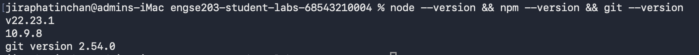
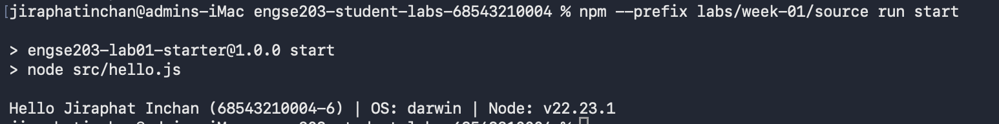

# Week 01 Evidence

# 1. ผล node --version, npm --version, git --version

## 2. ผล NPM Run Start

## 3. Reflection
- ได้เรียนรู้กระบวนการทำงานกับ Git ทั้งการสร้าง Branch, การ Commit งานอย่างเป็นระบบ และการส่ง Pull Request
- ได้ทดสอบการรัน Node.js และตรวจเช็คโครงสร้างไฟล์ด้วยสคริปต์อัตโนมัติ

## 4. Problems & Solutions
- ไม่พบปัญหาในการติดตั้งและการทำงาน